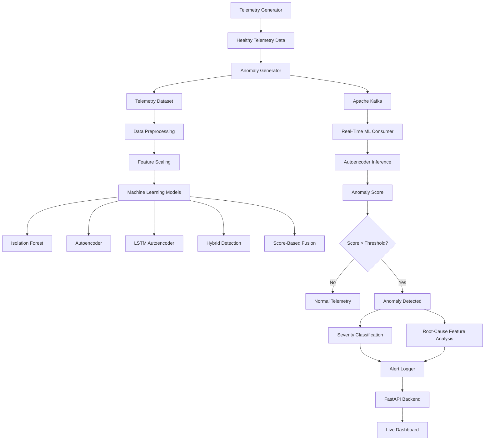
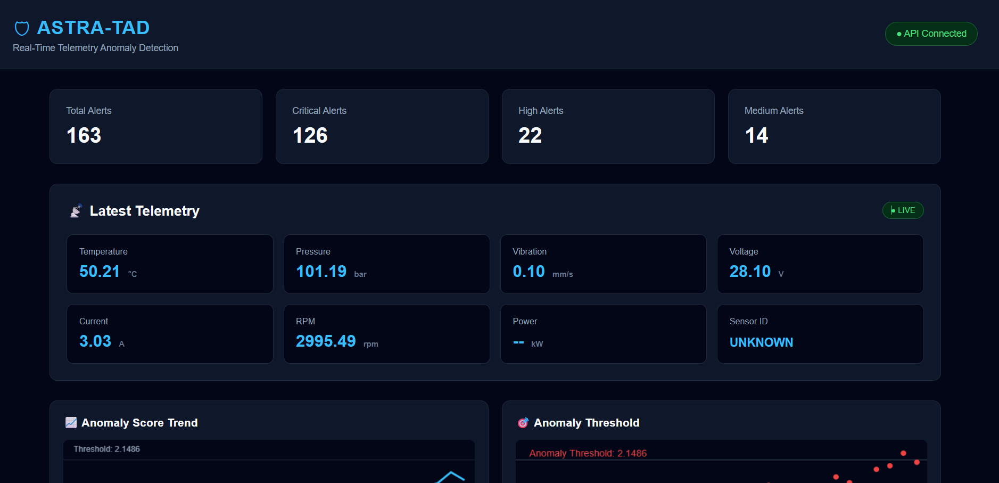
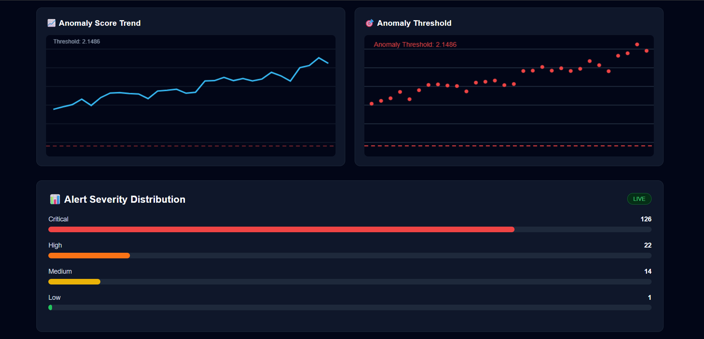
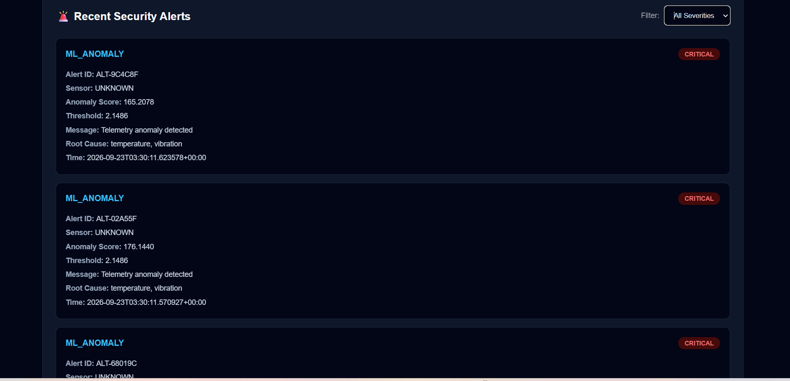
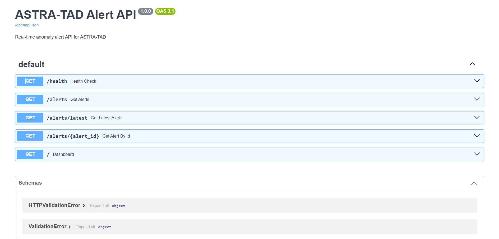

# ASTRA-TAD
### AI-Powered Real-Time Telemetry Anomaly Detection System

ASTRA-TAD is a real-time machine learning system designed to detect abnormal patterns in telemetry data using deep learning, anomaly detection algorithms, and real-time data streaming.

The system generates telemetry data, introduces different types of anomalies, streams the data through Apache Kafka, processes it using machine learning models, detects anomalous behavior, estimates contributing telemetry features, generates alerts, and presents the results through a FastAPI-powered live dashboard.

---

## 🎯 Project Objective

The main objective of ASTRA-TAD is to build an end-to-end real-time anomaly detection pipeline capable of:

- Generating healthy telemetry data
- Simulating realistic telemetry anomalies
- Processing and scaling telemetry features
- Detecting abnormal behavior using machine learning
- Comparing multiple anomaly detection approaches
- Processing telemetry in real time using Apache Kafka
- Generating automated anomaly alerts
- Estimating the telemetry features contributing to an anomaly
- Exposing results through REST APIs
- Visualizing telemetry and anomaly information through a web dashboard

---

# 🧠 Core Technologies

| Technology | Purpose |
|---|---|
| Python | Core programming language |
| NumPy | Numerical computation |
| Pandas | Data processing and analysis |
| PyTorch | Deep learning and Autoencoder models |
| Scikit-learn | Machine learning models and preprocessing |
| Apache Kafka | Real-time telemetry streaming |
| FastAPI | REST API backend |
| HTML / CSS / JavaScript | Dashboard interface |
| Matplotlib | Data visualization |
| Jupyter Notebook | Exploratory data analysis |
| Git / GitHub | Version control and project hosting |

---

# 🏗️ System Architecture



---

# 📊 Telemetry Features

ASTRA-TAD processes seven telemetry features:

| Feature | Description |
|---|---|
| Temperature | System/device temperature |
| Voltage | Electrical voltage |
| Current | Electrical current |
| Pressure | System pressure |
| Vibration | Vibration measurement |
| RPM | Rotational speed |
| Battery | Battery level |

These features are scaled before being passed into the machine learning models.

---

# 🚨 Simulated Anomaly Types

The project contains synthetic anomaly scenarios for evaluating the detection system.

### 1. Temperature Spike

Sudden increase in temperature beyond normal operating behavior.

### 2. Voltage Drop

Abnormal decrease in voltage.

### 3. Sensor Drift

Gradual deviation of sensor values from their normal behavior.

### 4. Stuck Sensor

A telemetry sensor remains approximately constant instead of changing naturally.

### 5. High Vibration

Abnormally high vibration levels.

### 6. Correlated Failure

Multiple telemetry parameters change together to simulate a related system failure.

### 7. Battery Degradation

Progressive decrease in battery performance.

---

# 🤖 Machine Learning Pipeline

ASTRA-TAD contains multiple anomaly detection approaches.

## 1. Isolation Forest

Isolation Forest is used as a classical machine learning baseline for detecting unusual telemetry observations.

It isolates observations using randomized decision trees. Unusual observations generally require fewer splits to isolate.

---

## 2. Autoencoder

The primary real-time deep learning detector is an Autoencoder.

The model learns to reconstruct normal telemetry patterns.

### Architecture

```text
Input
  ↓
7 Features
  ↓
16 Neurons
  ↓
8 Neurons
  ↓
3-D Latent Representation
  ↓
8 Neurons
  ↓
16 Neurons
  ↓
7 Features
  ↓
Reconstructed Telemetry
```

The reconstruction error is used as the anomaly score.

A large reconstruction error indicates that the telemetry pattern differs significantly from the learned normal behavior.

---

## 3. LSTM Autoencoder

An LSTM-based Autoencoder is included to investigate temporal dependencies in telemetry sequences.

This allows the project to analyze patterns where the order and history of telemetry observations are important.

---

## 4. Hybrid Detection

The project also contains hybrid anomaly detection logic that combines information from multiple detection approaches.

---

## 5. Score-Based Fusion

Score-based fusion combines anomaly scores to create a unified detection approach.

---

# 📈 Anomaly Detection

The real-time Autoencoder uses the following anomaly threshold:

```text
2.148575
```

For each incoming telemetry observation:

```text
Telemetry
    ↓
Feature Extraction
    ↓
Scaling
    ↓
Autoencoder
    ↓
Reconstruction
    ↓
Reconstruction Error
    ↓
Anomaly Score
    ↓
Compare with Threshold
    ↓
Normal / Anomaly
```

If:

```text
Anomaly Score > 2.148575
```

the observation is classified as anomalous.

---

# 🔍 Root-Cause Feature Analysis

When an anomaly is detected, ASTRA-TAD compares the original telemetry values with the reconstructed values.

The reconstruction errors are used to identify the telemetry features contributing most strongly to the detected anomaly.

The system reports the highest contributing features as potential root-cause indicators.

> Note: This is feature-contribution analysis based on reconstruction error. It should not be interpreted as proof of physical causation.

---

# ⚡ Real-Time Streaming Pipeline

ASTRA-TAD uses Apache Kafka to create a real-time telemetry pipeline.

```text
Telemetry Generator
        ↓
   Kafka Producer
        ↓
 Apache Kafka
        ↓
 telemetry topic
        ↓
 ML Consumer
        ↓
 Autoencoder
        ↓
 Anomaly Detection
        ↓
 Alert Logger
        ↓
 FastAPI
        ↓
 Dashboard
```

Kafka decouples telemetry generation from machine learning inference and allows the detection component to process incoming observations continuously.

---

# 🚨 Alert System

When an anomaly is detected, ASTRA-TAD generates an alert containing information such as:

- Alert ID
- Timestamp
- Alert type
- Severity
- Anomaly score
- Detection threshold
- Telemetry values
- Potential contributing features

Example structure:

```json
{
  "alert_id": "ALT-XXXXXX",
  "alert_type": "ML_ANOMALY",
  "severity": "CRITICAL",
  "score": 160.96,
  "threshold": 2.148575
}
```

Alerts are stored in JSON Lines format for later inspection.

---

# 🌐 FastAPI Backend

The project provides a FastAPI backend for accessing anomaly information.

### Main endpoints

| Endpoint | Purpose |
|---|---|
| `/` | Dashboard |
| `/health` | API health check |
| `/alerts` | Retrieve alerts |
| `/alerts/latest` | Retrieve latest alerts |
| `/alerts/{alert_id}` | Retrieve a specific alert |
| `/docs` | Interactive API documentation |

The API runs locally on:

```text
http://127.0.0.1:8001
```

Interactive API documentation:

```text
http://127.0.0.1:8001/docs
```

---

# 📊 Live Dashboard

ASTRA-TAD includes a web-based monitoring dashboard.

The dashboard provides:

- API status
- Total alert count
- Critical alert count
- High-severity alert count
- Medium-severity alert count
- Severity distribution
- Latest telemetry
- Anomaly scores
- Detection threshold
- Recent anomaly alerts
- Automatic refresh

The dashboard communicates with the FastAPI backend to retrieve the latest anomaly information.
## Dashboard Preview




## Real-Time Alerts



## FastAPI Documentation


---

# 📁 Project Structure

```text
ASTRA-TAD/
│
├── api/
│   └── main.py
│
├── dashboard/
│   └── index.html
│
├── data/
│   ├── processed/
│   └── synthetic/
│
├── docs/
│   └── baseline_results.md
│
├── evaluation/
│   ├── evaluate_model.py
│   ├── visualize_results.py
│   └── *.png
│
├── models/
│   ├── isolation_forest.joblib
│   ├── lstm_autoencoder.pth
│   ├── telemetry_autoencoder.pth
│   └── telemetry_scaler.joblib
│
├── notebooks/
│   └── 01_data_exploration.ipynb
│
├── simulator/
│   ├── telemetry_generator.py
│   └── anomaly_generator.py
│
├── src/
│   ├── detection/
│   ├── evaluation/
│   ├── models/
│   ├── preprocessing/
│   └── test_environment.py
│
├── streaming/
│   ├── alert_logger.py
│   ├── hybrid_ml_consumer.py
│   ├── kafka_producer.py
│   ├── ml_consumer.py
│   └── telemetry_producer.py
│
├── docker-compose.yml
├── requirements.txt
├── README.md
└── .gitignore
```

---

# ⚙️ Installation

## 1. Clone the repository

```bash
git clone https://github.com/GOPIKA-SINDHURI/ASTRA-TAD.git
cd ASTRA-TAD
```

---

## 2. Create a virtual environment

### Windows PowerShell

```powershell
python -m venv .venv
```

Activate it:

```powershell
.\.venv\Scripts\Activate.ps1
```

---

## 3. Install dependencies

```powershell
pip install -r requirements.txt
```

---

# 📨 Start Apache Kafka

ASTRA-TAD requires Kafka for the real-time streaming pipeline.

The project also contains:

```text
docker-compose.yml
```

for containerized infrastructure.

Start the required services using the project's Docker Compose configuration.

---

# ▶️ Running ASTRA-TAD

## Step 1 — Activate the environment

```powershell
cd C:\Projects\ASTRA-TAD
.\.venv\Scripts\Activate.ps1
```

---

## Step 2 — Start the ML Consumer

Open a PowerShell terminal:

```powershell
python -m streaming.ml_consumer
```

The consumer loads the trained Autoencoder and waits for telemetry messages from Kafka.

---

## Step 3 — Start the FastAPI server

Open another PowerShell terminal:

```powershell
cd C:\Projects\ASTRA-TAD
.\.venv\Scripts\Activate.ps1
python -m uvicorn api.main:app --reload --host 127.0.0.1 --port 8001
```

---

## Step 4 — Start telemetry/anomaly generation

Open another terminal:

```powershell
cd C:\Projects\ASTRA-TAD
.\.venv\Scripts\Activate.ps1
python simulator\anomaly_generator.py
```

The generator produces telemetry containing normal and synthetic anomalous observations and publishes the data to Kafka.

---

## Step 5 — Open the dashboard

Open:

```text
http://127.0.0.1:8001/
```

You should see the ASTRA-TAD monitoring dashboard.

---

# 🧪 Model Evaluation

The project includes evaluation scripts for measuring anomaly detection behavior.

Run:

```powershell
python evaluation\evaluate_model.py
```

Visualization:

```powershell
python evaluation\visualize_results.py
```

The visualization pipeline generates plots including:

```text
evaluation/
├── anomaly_score_distribution.png
├── anomaly_score_stream.png
├── detection_rate_by_type.png
└── mean_score_by_type.png
```

---

# 📉 Evaluation Workflow

```text
Synthetic Dataset
       ↓
Trained Model
       ↓
Generate Anomaly Scores
       ↓
Apply Detection Threshold
       ↓
Compare Predictions
       ↓
Ground Truth
       ↓
Evaluation Metrics
       ↓
Visualization
```

The evaluation pipeline can be used to study detection behavior across different synthetic anomaly types.

---

# 🔬 Research / Experimentation Components

The repository also contains experimental components for:

- Isolation Forest evaluation
- Autoencoder evaluation
- LSTM Autoencoder evaluation
- Anomaly-type analysis
- Threshold optimization
- Hybrid detection
- Score-based fusion
- Stuck-sensor detection
- Root-cause feature analysis

This makes the project suitable for experimentation with different anomaly detection strategies rather than relying on a single model.

---

# 🎯 Key Features

- Real-time telemetry processing
- Synthetic telemetry generation
- Multiple anomaly types
- Deep-learning-based anomaly detection
- Autoencoder reconstruction-error detection
- LSTM Autoencoder experimentation
- Isolation Forest baseline
- Hybrid anomaly detection
- Score-based fusion
- Root-cause feature analysis
- Apache Kafka streaming
- Automated alert generation
- FastAPI REST API
- Interactive monitoring dashboard
- Evaluation and visualization pipeline
- Modular project architecture

---

# 🔮 Future Improvements

Possible future extensions include:

- Real industrial telemetry datasets
- Online model retraining
- Adaptive anomaly thresholds
- Advanced time-series models
- Transformer-based anomaly detection
- Improved root-cause analysis
- Database-backed alert storage
- Authentication and authorization
- Cloud deployment
- Containerized end-to-end deployment
- Monitoring and observability
- Model drift detection
- Automated model performance monitoring

---

# 🧑‍💻 Project Workflow

The complete ASTRA-TAD workflow can be summarized as:

```text
Generate Telemetry
       ↓
Create Anomalies
       ↓
Preprocess Data
       ↓
Train / Load ML Models
       ↓
Stream Through Kafka
       ↓
Real-Time ML Inference
       ↓
Calculate Anomaly Score
       ↓
Threshold-Based Detection
       ↓
Feature Contribution Analysis
       ↓
Generate Alert
       ↓
FastAPI
       ↓
Live Dashboard
```

---

# 📌 Project Status

ASTRA-TAD currently contains:

- Synthetic telemetry generation
- Multiple anomaly generation methods
- Multiple ML/deep-learning detection approaches
- Real-time Kafka processing
- Autoencoder-based real-time detection
- Alert logging
- Root-cause feature analysis
- FastAPI backend
- Live monitoring dashboard
- Evaluation and visualization tools
- GitHub-based project documentation

---

# 👩‍💻 Author

**Gopika Sindhuri**

B.Tech Computer Science Engineering

---

# ⭐ Project

If you find the project useful for learning about machine learning, anomaly detection, real-time streaming, or telemetry analytics, consider giving the repository a star.
